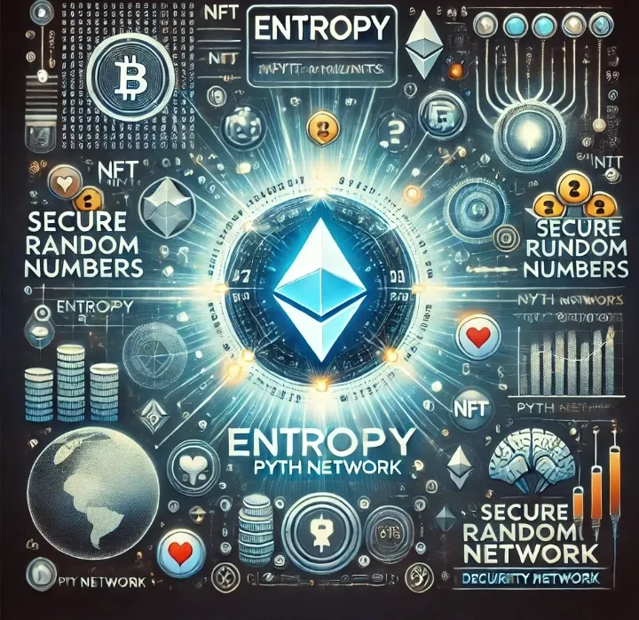

# 🎲 EntropyPuzzle: Decentralized Entropy Generation 🔗

<p align="center">
    
</p>

[](https://docs.soliditylang.org/)
[](https://reactjs.org/)
[](https://ethereum.org/)
[](https://hardhat.org/)

## 🌐 Blockchain and Entropy

In blockchain systems, true randomness is challenging to achieve. Traditional random number generators are predictable and can be manipulated. Entropy, which measures the degree of unpredictability, is crucial for cryptographic security, smart contracts, and applications like gaming, gambling, and scientific simulations.

## 🎯 Project Overview

EntropyPuzzle is a blockchain-based entropy generation system that creates decentralized randomness through a unique lottery mechanism. Participants compete either adversarially or altruistically to generate entropy, win prizes, and fund social projects.

### 🔍 How It Works

- Users send small ETH amounts to modify a lottery number
- Players can win by matching their wallet address with the lottery number
- A percentage of deposits fund social impact projects
- Combines adversarial and altruistic motivations for system resilience

## 🚀 Key Features

- Decentralized entropy generation
- Lottery-based participation
- Social impact funding mechanism
- Adaptive difficulty through match length control
- Transparent and accessible blockchain interactions

## 🛠 Tech Stack

- **Smart Contracts**: Solidity ^0.8.x
- **Blockchain**: Ethereum
- **Development**: Hardhat
- **Frontend**: React + Vite
- **Interaction**: ethers.js

## 📁 Project Structure

```
GoodNumbers/
├── contract/
│   ├── contracts/
│   │   └── Adversarial-Entropy-Game_Interface.sol
│   │   └── Adversarial-Entropy-Game.sol
│   ├── scripts/
│   │   ├── deploy.js
│   │   └── interact.js
│   └── hardhat.config.js
└── client/
    ├── src/
    │   ├── App.jsx
    │   ├── App.css
    │   ├── components/
		│   │		└── ContractInteraction.jsx
    │   └── context/
		│   		└── ToastProvider.jsx
    ├── index.html
    ├── package.json
    └── vite.config.js
```

## 🚀 Quick Start

### Prerequisites

- Node.js ≥ 14.0.0
- MetaMask
- Git

### Installation

```bash
# Clone the repository
git clone https://github.com/your-username/GoodNumbers.git
cd GoodNumbers

# Install contract dependencies
cd contract
npm install

# Install client dependencies
cd ../client
npm install
```

### Testing

```bash
# To run tests:
cd contract
npx hardhat test
```

### Local Deployment

1. Start local Hardhat node
```bash
cd contract
npx hardhat node
```

2. Deploy contract
```bash
npx hardhat run scripts/deploy.js --network localhost
```

3. Run frontend
```bash
cd ../client
npm run dev
```

### MetaMask Network Configurations

#### Local Hardhat Network
- Network Name: Localhost 8545
- RPC URL: http://127.0.0.1:8545
- Chain ID: 1337
- Currency Symbol: ETH

#### Sepolia Testnet
- Network Name: Sepolia
- RPC URL: https://sepolia.infura.io/v3/
- Chain ID: 11155111
- Currency Symbol: ETH

#### Arbitrum Sepolia
- Network Name: Arbitrum Sepolia
- RPC URL: https://sepolia-rollup.arbitrum.io/rpc
- Chain ID: 421614
- Currency Symbol: ETH


## 📖 Contract Functions

- `checkNumber()`: Query current lottery number
- `getNewNumber()`: Generate new entropy
- `claimLottery()`: Win prize by matching address
- `claimDevelopmentAndDonation()`: Withdraw funds for development
- `setMatchLength()`: Adjust game difficulty
- `getContractState()`: Get full contract overview

## 🤝 Contributing

1. Fork the project
2. Create your feature branch (`git checkout -b feature/AmazingFeature`)
3. Commit changes (`git commit -m 'Add: Amazing Feature'`)
4. Push to branch (`git push origin feature/AmazingFeature`)
5. Open Pull Request

## 📝 License

Distributed under MIT License.

## 📫 Contact

[Your Contact Information]

---
